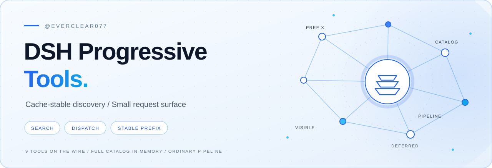
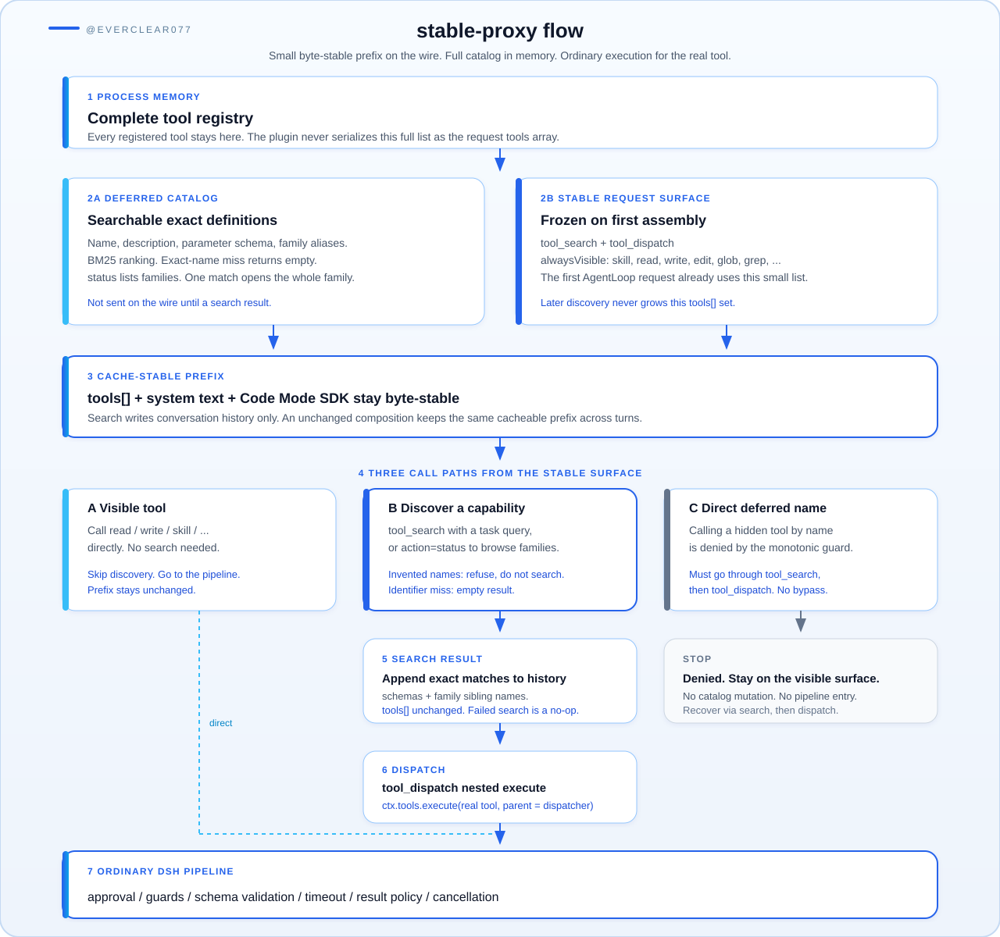

# DSH Progressive Tools

[](https://github.com/everclear077/dsh-progressive-tools/actions/workflows/ci.yml)
[](./CHANGELOG.md)
[](./LICENSE)

Cache-stable progressive tool discovery for DeepSeek Harness. The default mode
sends a small, fixed tool surface on the first request, keeps the complete
catalog in process memory, and executes discovered tools through the ordinary
Harness pipeline.

<p align="center">
  
</p>

[中文文档](./README.zh-CN.md)

[Documentation map](./docs/README.md) · [Getting started](./docs/getting-started.md) ·
[Upgrade guide](./docs/migration.md) · [Troubleshooting](./docs/troubleshooting.md)

## Why

Every visible tool definition consumes input tokens on every request. Changing
that definition list later also changes the request prefix and reduces context
cache reuse. Progressive disclosure needs both properties at once:

- a small first request;
- a byte-stable tool and system prefix across later requests.

The default `stable-proxy` mode provides that contract:

<p align="center">
  
</p>

Search changes conversation history, not the top-level tool list. Approval,
guards, argument validation, timeout wrappers, result policy, deferred context,
and cancellation still run for the selected real tool.

## Measured impact

The tables below compare **the plugin off** (the host sends every registered
tool on every request: **71** definitions in this profile) with **the current
defaults on** (`stable-proxy`, filesystem tools always visible, `maxResults: 2`:
**9** definitions on the wire). Both arms used the same eight task families,
100 comparable turns, and the same local web profile. Cache-read tokens are
the cached request prefix the host reports; uncached input is everything else
that still has to be sent.

Headline: ordinary file and coding work keeps uncached input almost unchanged,
cuts cache-read volume by about four fifths, lowers output, and finishes sooner.
Catalog browsing and invented-name probes are the remaining places where the
plugin still writes extra uncached tokens.

### Overall tokens, cache, and latency (100 turns)

| Metric | Plugin off | Plugin on | Change |
| --- | ---: | ---: | ---: |
| Visible tools per request | 71 | 9 | −87% |
| Uncached input tokens | 130,122 | 155,823 | **+20%** |
| Output tokens | 28,532 | 24,418 | **−14%** |
| Cache-read tokens | 3,133,428 | 663,687 | **−79%** |
| Combined (input + output + cache read) | 3,292,082 | 843,928 | **−74%** |
| Cache share of the prompt (`cache / (input + cache)`) | 96.0% | 81.0% | −15 pp |
| Mean latency | 45.2 s | 20.9 s | **−54%** |
| p50 latency | 31.7 s | 18.8 s | **−41%** |
| p90 latency | 85.4 s | 34.8 s | **−59%** |

Uncached input rises because discovery results (and, in the first 100-turn
run, searches that only proved a name was missing) land in conversation
history. Cache-read volume falls because the stable prefix no longer carries
dozens of unused schemas. Billing still usually tracks cache reads at a lower
rate than fresh input; the combined column is the raw token volume, not a
vendor price. These rows are not a bill. `omittedDefinitionTokens`
(still mirrored as `estimatedSavedTokens` in result metadata) estimates
deferred definitions left off the top-level tool list. It is not a net task
saving. See [cost metrics](docs/cost-metrics.md).

Restricting the same 100 turns to ordinary work (**S1–S7**, 87 turns, no
invented-name probes):

| Metric | Plugin off | Plugin on | Change |
| --- | ---: | ---: | ---: |
| Uncached input tokens | 120,753 | 121,105 | **+0.3%** |
| Output tokens | 26,624 | 20,869 | **−22%** |
| Cache-read tokens | 2,927,348 | 573,831 | **−80%** |

### Tokens by task family

| Family | Turns | Input off | Input on | Output off | Output on | Cache read off | Cache read on |
| --- | ---: | ---: | ---: | ---: | ---: | ---: | ---: |
| S1 Arithmetic, no tools | 12 | 1,892 | 8,325 | 532 | 364 | 196,852 | 36,231 |
| S2 Inspect workspace | 13 | 15,729 | 17,837 | 2,446 | 2,616 | 418,816 | 94,720 |
| S3 Create and reread a file | 12 | 17,022 | 17,584 | 2,521 | 2,347 | 603,136 | 122,880 |
| S4 Read `README.md` | 13 | 15,841 | 15,594 | 2,600 | 1,567 | 518,912 | 83,200 |
| S5 Browse the hidden catalog | 12 | 38,561 | 27,086 | 12,539 | 8,055 | 367,104 | 76,800 |
| S6 Multi-file inspect | 13 | 19,695 | 21,036 | 4,832 | 4,768 | 435,712 | 83,200 |
| S7 Remember a follow-up | 12 | 12,013 | 13,643 | 1,154 | 1,152 | 386,816 | 76,800 |
| S8 Call a missing name | 13 | 9,369 | 34,718 | 1,908 | 3,549 | 206,080 | 89,856 |
| **Total** | **100** | **130,122** | **155,823** | **28,532** | **24,418** | **3,133,428** | **663,687** |

S1 pays a larger 9-tool prefix than a 4-tool prefix would, but still far less
cache than 71 native schemas. S2–S4 and S6 no longer search: `read` / `write` /
`glob` / `grep` are on the stable surface. S5 is cheaper on the plugin because
`tool_search` with `action: "status"` replaces long host-side exploration. S8
in this 100-turn table still searched on most plugin rounds; the follow-up
below is the current behavior.

### Latency by task family

| Family | Mean off | Mean on | Change | p50 off | p50 on |
| --- | ---: | ---: | ---: | ---: | ---: |
| S1 Arithmetic, no tools | 11.3 s | 7.5 s | −34% | 9.6 s | 6.8 s |
| S2 Inspect workspace | 69.8 s | 20.3 s | −71% | 63.6 s | 18.8 s |
| S3 Create and reread a file | 79.4 s | 23.7 s | −70% | 67.0 s | 23.0 s |
| S4 Read `README.md` | 67.9 s | 15.6 s | −77% | 67.2 s | 16.6 s |
| S5 Browse the hidden catalog | 47.2 s | 31.8 s | −33% | 38.6 s | 30.6 s |
| S6 Multi-file inspect | 33.1 s | 25.6 s | −23% | 31.4 s | 25.0 s |
| S7 Remember a follow-up | 29.7 s | 21.6 s | −27% | 22.9 s | 17.0 s |
| S8 Call a missing name | 22.1 s | 21.0 s | −5% | 17.8 s | 20.9 s |
| **All 100 turns** | **45.2 s** | **20.9 s** | **−54%** | **31.7 s** | **18.8 s** |

### Task results and prefix stability

| Check | Plugin off | Plugin on |
| --- | --- | --- |
| Completed turns | 100 / 100 | 100 / 100 |
| S1–S7 success | 87 / 87 (100%) | 87 / 87 (100%) |
| S8 refused to *invoke* the fake tool | 13 / 13 | 13 / 13 |
| S8 grader “success” in the 100-turn run | 12 / 13 (1 partial) | 0 / 13 (grader treated `tool_search` as failure) |
| Top-level tool list stable across the turn | 100 / 100 | 100 / 100 |
| Turns that called `tool_search` | 0% | 24% (all of S5, 12 / 13 of S8) |
| Turns that called `tool_dispatch` | n/a | 0% |

S1–S7 task quality did not regress. The 100-turn S8 grader was too strict: it
flagged a search whose query contained the fake name, even though dispatch
never ran. After the current “do not search merely to prove a named tool is
missing” guidance (and empty results for unmatched identifier queries), a
dedicated **13-turn S8 rerun** looked like this:

| S8 (missing name) | 100-turn plugin run | Later 13-turn rerun |
| --- | ---: | ---: |
| Search rate | 92% | **0%** |
| Uncached input | 34,718 | **13,404 (−61%)** |
| Output | 3,549 | **2,078 (−41%)** |
| Mean latency | 21.0 s | **11.4 s (−45%)** |
| Warm-turn uncached input | ~3,500 with search / 819 without | **716** |
| Fake tool invoked | 0 | 0 |
| Grader success / partial / fail | 0 / 1 / 12 | 10 / 3 / 0 |

The three later partials were still correct refusals; the grader missed
wording such as “doesn't exist” / “can't”.

### Why the defaults moved filesystem tools onto the surface

An earlier 100-turn plugin run used a **4-tool** prefix (`tool_search`,
`tool_dispatch`, `skill`, `ask_user_question`) and `maxResults: 5`. File work
then paid a search-then-dispatch round, which is where most of the +80%
uncached-input tax came from:

| 100-turn plugin arm | 4-tool prefix | Current 9-tool prefix | Change |
| --- | ---: | ---: | ---: |
| Uncached input | 233,716 | 155,823 | −33% |
| Output | 34,933 | 24,418 | −30% |
| Cache-read | 744,898 | 663,687 | −11% |
| Mean latency | 31.9 s | 20.9 s | −35% |
| File-task search / dispatch | 100% / 100% on S2–S4, S6 | **0% / 0%** | — |

These numbers are a snapshot of this host's tool composition, not a promise
for every profile. A larger native catalog makes the cache saving larger; a
task mix that always needs deferred tools will still pay discovery into
history. Re-measure after changing `alwaysVisible` or the installed plugin
set.

## Features

- Minimal tool definitions on the actual first AgentLoop request.
- Byte-stable native tool list and Code Mode SDK across discovery calls.
- Exact tool matches with full name, description, and parameter schema.
- Family-wide discovery: each match names every sibling tool of its family, so
  one search opens a plugin's complete dispatchable surface.
- Browsable `status` catalog listing, with an optional
  `statusGrantsDiscovery` grant for trusted deployments.
- Bounded conversation growth: search results record per-call discovery
  increments while resume state travels in presentation metadata.
- Deterministic BM25-style lexical ranking over names, descriptions, nested
  parameter descriptions, enums, family metadata, and multilingual aliases.
- Stable `tool_dispatch` transport with runtime schema validation through the
  original tool definition.
- Monotonic guard that rejects direct calls to deferred tools and permits only
  dispatcher-owned nested execution trees.
- Support for inherited and agent-scoped tools.
- Durable discovery reconstruction for top-level and Code Mode search calls.
- Optional skill-to-family discovery bindings.
- `dynamic` compatibility mode for deployments that require native definitions
  after activation.
- Reversible Cordis effects for unload and configuration reload.

## Requirements

- Node.js `^22.19.0` or `>=24.0.0`
- Host runtime `0.1.5-rc.1` (exact tested core peer versions)
- pnpm for source installation and development

## Runtime compatibility

Version `0.5.0` targets runtime `0.1.5-rc.1`. Core peer versions are
pinned to that tested release; older runtimes and later prereleases are not
covered. Earlier plugin versions predate this adaptation. The command below
uses the release tag for reproducible deployments.

## Install

```sh
dsh plugin --profile web add github:everclear077/dsh-progressive-tools#v0.5.0
```

The same version is published on the npm registry as `dsh-progressive-tools@0.5.0`.

Source installs run the package `prepare` script. If pnpm asks for build
authorization, add the exact package key it reports to the profile's
`pnpm-workspace.yaml`:

```yaml
allowBuilds:
  dsh-progressive-tools: true
```

Verify the composed layer before starting the profile:

```sh
dsh --profile web --dump-config
```

The dump should contain the `progressive-tools` row contributed by this bundle.

## Use

The default direct surface contains:

- `tool_search`;
- `tool_dispatch`;
- `skill`, `ask_user_question`, `report`, `submit_*`, and
  `structured_output*` when registered;
- `read`, `write`, `edit`, `glob`, and `grep` when registered;
- reserved Harness presentation transports when the active tool mode needs
  them.

No special wording is required in an ordinary conversation. A stable system
instruction tells the agent to search before declaring a needed capability
class unavailable, and to refuse invented or uncallable names from the visible
surface without searching. If an identifier query still runs and matches no
catalog name, search returns no definitions instead of unrelated schemas.

Discovery returns exact definitions:

```json
{
  "query": "browser navigation",
  "max_results": 2
}
```

The next call uses one returned definition:

```json
{
  "name": "browser_open",
  "arguments": {
    "url": "https://example.com"
  }
}
```

The result lists each matched family once. Siblings that did not make the
top-ranked slice are marked `name-only`: they are dispatchable, and one
exact-name search loads their parameters. An exact registered name returns
only that tool. A repeated search returns a short notice when that same
definition is still in derived history; pass `reload: true` for the full
schema. The program value of `tool_dispatch` is `{ protocol, tool, value }`
and does not repeat the rendered body. Set `legacyResults: true` to restore
the previous envelopes. `resultBudget` also shortens the model-facing
`run_code` text and leaves the program value intact. `autoloadMaxTools`
and `profile: auto` stay off unless set; the default surface is unchanged.

`tool_search` also accepts `{"action":"status"}`, which lists every deferred
family with its member tool names alongside catalog and savings estimates. By
default the listing is browse-only: dispatching an unseen name still requires
one exact-name search, and the rejection message says so. Deployments that
prefer immediate access can set `statusGrantsDiscovery: true`. Search results
are append-only conversation content; they never add native definitions to the
top-level request.

## Configure

The default configuration is intentionally small:

```yaml
- id: progressive-tools
  config:
    mode: stable-proxy
    toolName: tool_search
    dispatchToolName: tool_dispatch
    maxResults: 2
    requireDiscovery: true
    statusGrantsDiscovery: false
    deferToolGuidance: true
    alwaysVisible:
      - skill
      - ask_user_question
      - report
      - submit_*
      - structured_output*
      - read
      - write
      - edit
      - glob
      - grep
```

Family rules improve search without changing the stable request surface:

```yaml
- id: progressive-tools
  config:
    groups:
      - id: browser
        description: Browser navigation and page interaction
        aliases: [browser, web page, 浏览器]
        include: [browser_*]
      - id: database
        description: Database inspection and queries
        aliases: [database, sql, 数据库]
        include: [db_*, sql_*]
```

See [configuration](./docs/configuration.md) for every option, the
plugin-ecosystem onboarding checklist (`alwaysVisible` for high-frequency
tools, `skillBindings` for Skill-shipping packages, explicit `groups` for
unconventional names), and the migration notes for `dynamic` mode. The
[progressive disclosure model](./docs/progressive-disclosure.md) maps Skills,
exact tool definitions, execution, and provider capability gaps.

## Execution and security semantics

Stable mode filters the authoritative prompt assembly instead of changing the
registry view. A direct call to a deferred name is then denied by a monotonic
tool guard. `tool_dispatch` creates a nested execution with the original agent,
signal, root call identity, arguments, and real tool name, so normal DSH policy
continues to apply to that real tool.

The guard is a routing invariant, not a replacement for approval or sandbox
policy. Security-sensitive deployments should keep their existing controls
enabled.

## Trade-offs

- Deferred tools lose provider-native argument grammar at the outer request.
  Their original schema is validated at dispatch time by DSH.
- A task may need one discovery call before execution.
- Family siblings become dispatchable before their schemas were shown; the
  pipeline still validates every call, but complex or side-effectful siblings
  are best schema-loaded first with one exact-name search.
- Search is deterministic lexical ranking, not an embedding service.
- Search results add only matched definitions to conversation history, but those
  definitions remain there until normal compaction.
- A registry or composition change can legitimately alter the next prompt.
  Discovery alone does not.

## Development

```sh
pnpm install
pnpm run check
```

The test suite includes a real AgentLoop request test that captures the first
wire-ready tool array and verifies that discovery leaves both tools and system
text unchanged.

The implementation follows the public references for
[architecture](https://deepseek-harness.github.io/deepseek-harness/reference/),
[system prompt assembly](https://deepseek-harness.github.io/deepseek-harness/reference/subsystems/system-prompt),
[tool execution](https://deepseek-harness.github.io/deepseek-harness/reference/subsystems/tools),
[skills](https://deepseek-harness.github.io/deepseek-harness/reference/subsystems/skills),
and [plugin packaging](https://deepseek-harness.github.io/deepseek-harness/develop/basic/publish).

## License

[MIT](./LICENSE)
