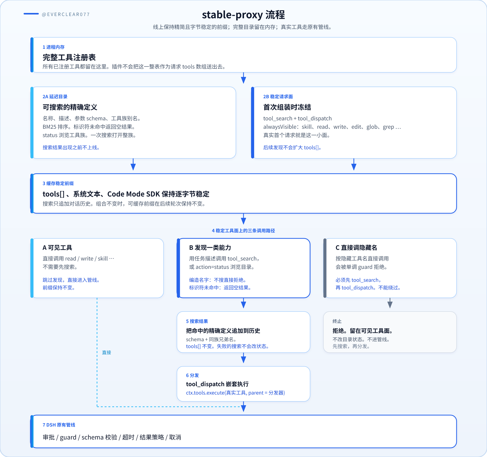

# DSH Progressive Tools

为 DeepSeek Harness 提供缓存稳定的渐进式工具发现。默认模式从真实首个请求
开始只发送固定的小工具面，完整目录保留在进程内，搜索到的工具仍通过 DSH
原有执行管线完成调用。

<p align="center">
  
</p>

[English](./README.md)

[文档导航](./docs/README.md) · [快速上手](./docs/getting-started.md) ·
[升级指南](./docs/migration.md) · [问题排查](./docs/troubleshooting.md)

## 解决的问题

每个可见工具的名称、描述和参数 schema 都会重复占用请求 token。如果后续
再动态改变工具列表，请求前缀也会变化，导致上下文缓存无法继续复用。

默认的 `stable-proxy` 模式同时保证：

- 第一次请求就是精简工具面；
- 搜索前后顶层工具定义和系统文本保持逐字节稳定。

<p align="center">
  
</p>

搜索只追加对话历史，不改变顶层 `tools` 数组。真实工具原有的审批、guard、
参数校验、超时、结果策略、延迟上下文和取消信号仍然生效。

## 实测影响

下表对比 **关闭插件**（每次请求都把已注册工具全部送上线，本 profile 为
**71** 个定义）和 **当前默认开启**（`stable-proxy`，文件系统工具常驻，
`maxResults: 2`，线上 **9** 个定义）。两组使用同一批 8 类任务、100 轮可对
比对话、同一本地 web profile。缓存读是宿主上报的已缓存请求前缀；未缓存
输入是其余仍需发送的 token。

结论先说清楚：日常读写和改文件时，未缓存输入几乎持平，缓存读大约少四
分之五，输出更少，平均耗时更短。多出来的未缓存输入，主要出现在目录浏览
和“证明某个名字不存在”的探测上。

### 总体 token、缓存与延迟（100 轮）

| 指标 | 关闭插件 | 开启插件 | 变化 |
| --- | ---: | ---: | ---: |
| 每次请求可见工具数 | 71 | 9 | −87% |
| 未缓存输入 token | 130,122 | 155,823 | **+20%** |
| 输出 token | 28,532 | 24,418 | **−14%** |
| 缓存读 token | 3,133,428 | 663,687 | **−79%** |
| 合计（输入 + 输出 + 缓存读） | 3,292,082 | 843,928 | **−74%** |
| 提示中的缓存占比（`cache / (input + cache)`） | 96.0% | 81.0% | −15 个百分点 |
| 平均延迟 | 45.2 s | 20.9 s | **−54%** |
| p50 延迟 | 31.7 s | 18.8 s | **−41%** |
| p90 延迟 | 85.4 s | 34.8 s | **−59%** |

未缓存输入上升，是因为搜索结果（以及首轮 100 测里为证明名字不存在而发起
的搜索）会写入对话历史。缓存读下降，是因为稳定前缀不再携带大量用不到的
schema。计费通常把缓存读标得比新输入便宜；合计列是原始 token 量，不是某
家的价目。

只看日常工作（**S1–S7**，87 轮，不含假名字探测）：

| 指标 | 关闭插件 | 开启插件 | 变化 |
| --- | ---: | ---: | ---: |
| 未缓存输入 token | 120,753 | 121,105 | **+0.3%** |
| 输出 token | 26,624 | 20,869 | **−22%** |
| 缓存读 token | 2,927,348 | 573,831 | **−80%** |

### 分场景 token

| 场景 | 轮次 | 输入（关） | 输入（开） | 输出（关） | 输出（开） | 缓存读（关） | 缓存读（开） |
| --- | ---: | ---: | ---: | ---: | ---: | ---: | ---: |
| S1 心算、不用工具 | 12 | 1,892 | 8,325 | 532 | 364 | 196,852 | 36,231 |
| S2 查看工作区 | 13 | 15,729 | 17,837 | 2,446 | 2,616 | 418,816 | 94,720 |
| S3 新建并回读文件 | 12 | 17,022 | 17,584 | 2,521 | 2,347 | 603,136 | 122,880 |
| S4 阅读 `README.md` | 13 | 15,841 | 15,594 | 2,600 | 1,567 | 518,912 | 83,200 |
| S5 浏览隐藏目录 | 12 | 38,561 | 27,086 | 12,539 | 8,055 | 367,104 | 76,800 |
| S6 多文件查看 | 13 | 19,695 | 21,036 | 4,832 | 4,768 | 435,712 | 83,200 |
| S7 记住后续口令 | 12 | 12,013 | 13,643 | 1,154 | 1,152 | 386,816 | 76,800 |
| S8 调用不存在的名字 | 13 | 9,369 | 34,718 | 1,908 | 3,549 | 206,080 | 89,856 |
| **合计** | **100** | **130,122** | **155,823** | **28,532** | **24,418** | **3,133,428** | **663,687** |

S1 的 9 工具前缀比 4 工具前缀贵一些，但缓存仍远小于 71 个原生 schema。
S2–S4、S6 不再搜索：`read` / `write` / `glob` / `grep` 已在稳定面上。S5
用 `tool_search` 的 `status` 代替宿主侧长时间摸索，所以更便宜。本表 S8
在插件侧仍以搜索为主；当前行为见后面的补测。

### 分场景延迟

| 场景 | 平均（关） | 平均（开） | 变化 | p50（关） | p50（开） |
| --- | ---: | ---: | ---: | ---: | ---: |
| S1 心算、不用工具 | 11.3 s | 7.5 s | −34% | 9.6 s | 6.8 s |
| S2 查看工作区 | 69.8 s | 20.3 s | −71% | 63.6 s | 18.8 s |
| S3 新建并回读文件 | 79.4 s | 23.7 s | −70% | 67.0 s | 23.0 s |
| S4 阅读 `README.md` | 67.9 s | 15.6 s | −77% | 67.2 s | 16.6 s |
| S5 浏览隐藏目录 | 47.2 s | 31.8 s | −33% | 38.6 s | 30.6 s |
| S6 多文件查看 | 33.1 s | 25.6 s | −23% | 31.4 s | 25.0 s |
| S7 记住后续口令 | 29.7 s | 21.6 s | −27% | 22.9 s | 17.0 s |
| S8 调用不存在的名字 | 22.1 s | 21.0 s | −5% | 17.8 s | 20.9 s |
| **全部 100 轮** | **45.2 s** | **20.9 s** | **−54%** | **31.7 s** | **18.8 s** |

### 任务结果与前缀稳定性

| 检查项 | 关闭插件 | 开启插件 |
| --- | --- | --- |
| 完成轮次 | 100 / 100 | 100 / 100 |
| S1–S7 成功 | 87 / 87（100%） | 87 / 87（100%） |
| S8 未真正 *调用* 假工具 | 13 / 13 | 13 / 13 |
| S8 在 100 轮里被打分器判成功 | 12 / 13（1 条部分） | 0 / 13（搜索参数里出现假名字即判失败） |
| 本轮顶层工具列表保持稳定 | 100 / 100 | 100 / 100 |
| 调用了 `tool_search` 的轮次 | 0% | 24%（S5 全部，S8 的 12 / 13） |
| 调用了 `tool_dispatch` 的轮次 | 不适用 | 0% |

S1–S7 的任务质量没有回退。100 轮 S8 的打分过严：只要搜索 query 里出现假
名字就算失败，即使从未分发。在当前“不要只为证明某个名字不存在而去搜索”
（未命中的标识符查询返回空结果）之后，单独重测 **13 轮 S8**：

| S8（缺失名字） | 100 轮插件侧 | 后来的 13 轮补测 |
| --- | ---: | ---: |
| 搜索率 | 92% | **0%** |
| 未缓存输入 | 34,718 | **13,404（−61%）** |
| 输出 | 3,549 | **2,078（−41%）** |
| 平均延迟 | 21.0 s | **11.4 s（−45%）** |
| 热路径未缓存输入 | 搜了约 3,500 / 没搜 819 | **716** |
| 假工具被调用 | 0 | 0 |
| 打分器 成功 / 部分 / 失败 | 0 / 1 / 12 | 10 / 3 / 0 |

后 3 条部分成功仍是正确拒绝；打分正则没吃到 `doesn't exist` / `can't` 这类
写法。

### 为什么默认要把文件系统工具放到稳定面上

更早一轮 100 测使用 **4 工具** 前缀（`tool_search`、`tool_dispatch`、
`skill`、`ask_user_question`）且 `maxResults: 5`。文件任务要先搜索再分发，
未缓存输入相对关闭插件大约多 80%，主要就来自这里：

| 100 轮插件侧 | 4 工具前缀 | 当前 9 工具前缀 | 变化 |
| --- | ---: | ---: | ---: |
| 未缓存输入 | 233,716 | 155,823 | −33% |
| 输出 | 34,933 | 24,418 | −30% |
| 缓存读 | 744,898 | 663,687 | −11% |
| 平均延迟 | 31.9 s | 20.9 s | −35% |
| 文件任务搜索 / 分发 | S2–S4、S6 为 100% / 100% | **0% / 0%** | — |

这是本机当前工具组合下的快照，不是对每个 profile 的承诺。原生目录越大，
缓存节省通常越大；如果任务总是要发现延迟工具，对话历史仍会吃搜索结果。
改 `alwaysVisible` 或已装插件集合之后应重新测量。

## 主要能力

- 真实 AgentLoop 第一次请求即发送最小工具定义。
- 搜索前后原生工具数组和 Code Mode SDK 保持稳定。
- 返回精确工具名称、完整描述和参数 schema，不再激活整个工具族。
- 工具族级发现：每条命中同时列出所属工具族的全部成员名，一次搜索即可
  铺开一个插件的完整可分发工具面。
- `status` 动作可浏览完整目录；可选 `statusGrantsDiscovery` 供受信任部署
  一次性解锁全部名字。
- 对话体量有界增长：搜索结果只记录本次新增的发现名单，恢复所需的累积
  状态走呈现元数据，不占对话 token。
- 确定性的 BM25 风格词法排序，覆盖工具名、描述、嵌套参数说明、枚举、
  工具族元数据及多语言别名。
- `tool_dispatch` 使用原始工具定义进行运行时参数校验和执行。
- 单调 guard 阻止隐藏工具被直接调用，只允许分发器拥有的嵌套调用树进入。
- 同时支持继承工具和 Agent 自有工具的渐进式隐藏。
- 从顶层结果和 Code Mode 日志恢复已发现工具。
- 可选 Skill 到工具族的发现联动。
- 保留 `dynamic` 兼容模式，供必须动态暴露原生 schema 的场景使用。
- Cordis effect 完整可逆，支持卸载和配置重载。

## 运行时兼容性

`0.6.0` 版本适配运行时 `0.1.7-rc.2`，核心 peer 依赖固定到该验证版本，
不承诺兼容旧运行时或后续预发布版本。安装时固定下面的 npm 版本，避免装到后续发布。

## 安装

从官方 npm 源把插件加入 Harness profile：

```sh
dsh plugin --profile web add npm:@everclear077/dsh-progressive-tools@0.6.0
```

Harness 会用当前 npm 源解析这个 `npm:` 说明。镜像源没有这个包时，改用官方源安装：

```sh
npm install @everclear077/dsh-progressive-tools@0.6.0 --registry https://registry.npmjs.org
```

包名是 `@everclear077/dsh-progressive-tools`。无作用域的 `dsh-progressive-tools`
属于其他账号，不是这个版本。

如果 pnpm 要求授权源码构建，把错误信息中给出的精确包名加入对应 profile 的
`pnpm-workspace.yaml`：

```yaml
allowBuilds:
  "@everclear077/dsh-progressive-tools": true
```

安装后检查组合结果：

```sh
dsh --profile web --dump-config
```

输出中应包含本 bundle 提供的 `progressive-tools` 配置行。

## 使用

默认直连工具面包括：

- `tool_search`；
- `tool_dispatch`；
- 已注册的 `skill`、`ask_user_question`、`report`、`submit_*` 和
  `structured_output*`；
- 已注册的 `read`、`write`、`edit`、`glob` 和 `grep`；
- 当前工具呈现模式所需的 Harness 保留传输工具。

正常对话不需要用户强制说明先调用 `tool_search`。插件会提供一段固定系统
说明：任务需要某类能力时先搜索；若只是被要求调用一个可见列表里没有的名字，
且说明无法调用即可，则不要为了证明它不存在而去搜索。若仍用标识符精确名搜
索且目录中没有该名字，搜索返回空结果，而不是用无关 schema 填满 `maxResults`。
命中的精确名只返回该工具。同一家族只列一次成员表。`tool_dispatch` 交给程序的
值是 `{ protocol, tool, value }`，不再附带一份相同的渲染正文。`legacyResults: true`
恢复旧返回信封。打开 `resultBudget` 后，`run_code` 的模型文本会被缩短，程序值保持完整。
`autoloadMaxTools` 和 `profile: auto` 默认关闭，不改变默认工具面。指标说明见 [成本指标](docs/cost-metrics.md)。

搜索工具定义：

```json
{
  "query": "浏览器页面操作",
  "max_results": 2
}
```

按搜索返回的精确 schema 分发：

```json
{
  "name": "browser_open",
  "arguments": {
    "url": "https://example.com"
  }
}
```

每条命中还会列出所属工具族的全部成员名，整个工具族在同一次搜索后即可
分发——没进入 Top-N 的兄弟工具可以直接按名字分发，或用一次精确名搜索
先取回它的 schema。

`tool_search` 也支持 `{"action":"status"}`，会列出全部延迟工具族及其成员
工具名，并附带目录规模和 token 估算。status 默认只用于浏览：分发未见过
的名字仍需一次精确名搜索，拒绝信息会明确指路。需要即时放行的部署可以
开启 `statusGrantsDiscovery: true`。搜索结果不会把命中工具加入下一次
请求的顶层工具数组。

## 配置

默认配置：

```yaml
- id: progressive-tools
  config:
    mode: stable-proxy
    toolName: tool_search
    dispatchToolName: tool_dispatch
    maxResults: 2
    requireDiscovery: true
    statusGrantsDiscovery: false
    deferToolGuidance: true
    alwaysVisible:
      - skill
      - ask_user_question
      - report
      - submit_*
      - structured_output*
      - read
      - write
      - edit
      - glob
      - grep
```

工具族只参与搜索排序，不会改变稳定请求工具面：

```yaml
- id: progressive-tools
  config:
    groups:
      - id: browser
        description: 浏览器导航与页面交互
        aliases: [browser, web page, 浏览器]
        include: [browser_*]
      - id: database
        description: 数据库检查与查询
        aliases: [database, sql, 数据库]
        include: [db_*, sql_*]
```

完整字段、既有插件生态的接入清单（高频工具配 `alwaysVisible`、带 Skill
的插件配 `skillBindings`、命名不规范的插件写显式 `groups` 规则）以及
`dynamic` 迁移说明见[配置参考](./docs/configuration.md)。
[渐进式披露模型](./docs/progressive-disclosure.md)进一步说明 Skills、工具定义、
执行层和供应方能力边界之间的关系。

## 执行与安全语义

稳定模式在官方 `system-prompt/assemble` 边界过滤最终请求，不改变注册表本身。
如果直接调用被延迟的工具名，单调工具 guard 会拒绝它。`tool_dispatch` 使用
原 Agent、取消信号、根调用标识、真实工具名和参数创建嵌套执行，因此真实
工具仍会经过 DSH 的完整策略链。

该 guard 只维护调用路由，不替代 approval、sandbox 或其他安全策略。

## 取舍

- 延迟工具不会出现在顶层请求的原生参数 grammar 中；DSH 会在分发时使用原始
  schema 校验。
- 一项任务可能先增加一次搜索调用。
- 同族兄弟工具在 schema 展示之前即可分发；执行管线仍会校验每次调用，但
  参数复杂或有副作用的兄弟工具建议先用一次精确名搜索取回 schema。
- 搜索是确定性词法排序，不依赖向量服务。
- 只有命中的定义进入对话，但会一直保留到常规 compaction。
- 工具注册或插件组合发生真实变化时，下一次系统前缀仍可能变化；普通搜索
  不会引起变化。

## 开发

```sh
pnpm install
pnpm run check
```

测试包含真实 AgentLoop 请求捕获，验证首个请求已经精简，并验证搜索后
`tools` 数组和系统文本完全不变。

实现依据官方的[架构参考](https://deepseek-harness.github.io/deepseek-harness/reference/)、
[系统提示子系统](https://deepseek-harness.github.io/deepseek-harness/reference/subsystems/system-prompt)、
[工具子系统](https://deepseek-harness.github.io/deepseek-harness/reference/subsystems/tools)、
[Skills 子系统](https://deepseek-harness.github.io/deepseek-harness/reference/subsystems/skills)
和[插件发布规范](https://deepseek-harness.github.io/deepseek-harness/develop/basic/publish)。

## 许可证

[MIT](./LICENSE)
